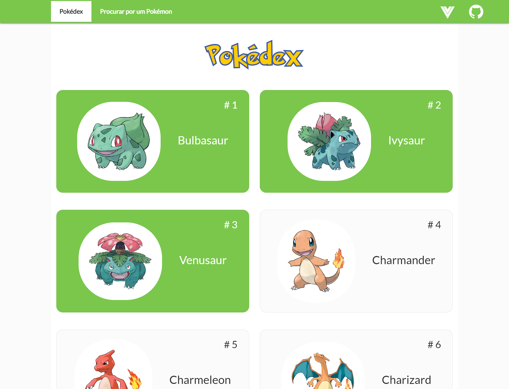
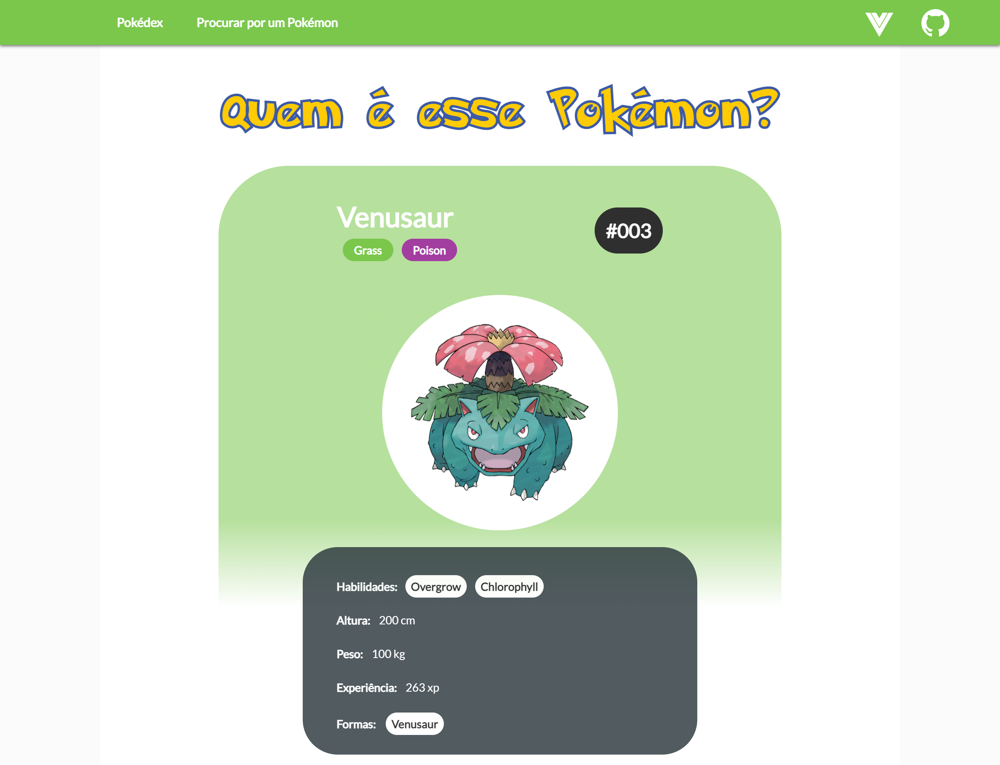

<h1 align="center">VueDex - LeafGreen - Uma Pokédex construída com Vue.js</h1>
<p align="center">
  
  <br>
  <i>Este webApp é um exemplo de aplicativo que pode ser construído com o 
    <br>framework JavaScript Vue.js.</i>
  <br>
</p>

<p align="center">
  <a href="https://nothingnothings.github.io/VueDex" target="_blank" rel="noreferrer noopener"><strong>https://nothingnothings.github.io/VueDex</strong></a>
  <br>
</p>


## Introdução







Single Page Application (SPA) construída com a library/framework Vue.js (npx vue create app). O design do app foi inspirado pelo site [https://pokeapi.co](https://pokeapi.co). Bootstrap, Flexbox e media queries foram utilizados na construção do design responsivo (tentativa de fornecer a melhor experiência possível a múltiplas configurações de tela/dispositivos, tanto desktop como mobile, com diferentes resoluções). Seguindo as últimas orientações do Framework Vue.js, o app foi constituído através do uso da Options API do Vue 3 e pacotes como 'vue-router'.

O app foi inicializado/bootstrapped com o comando/environment `npx vue create app` e implantado (deploy) com o GitHub Pages, assistido pelo recurso GitHub Actions.


[](http://hits.dwyl.com/nothingnothings/VueDex)


 
## Tecnologias
 
 Algumas das linguagens e libraries empregadas:
 
 - Node Package Manager (bootstrapping e gerenciamento do aplicativo React)
 - HTML5
 - SASS (para melhor organização das regras de CSS, nested rules, etc)
 - CSS3 (animações, Flexbox, media queries)
 - JavaScript "vanilla", para o setup de uma Single-Page Application no GitHub Pages (script posicionado no `<head>` do arquivo `index.html`)
 - Vue.JS versão 3 (framework JavaScript, que propõe a divisão integral do app em Vue components)
 - Typescript (para a type safety dos objetos recebidos pelos endpoints do backend; Models e Interfaces, etc.)
 - Vue Router (para a navegação entre as diferentes "páginas" do aplicativo)
 - Manage local de state (dois states principais: o central, em "App.js", usado nas páginas "Pokedex" e "Procurar por um Pokémon", e o relativo aos pokémons indivíduais,  localizado na página "PokemonDetails", acessada pela route "/pokedex/:idDoPokemon")
 - Bootstrap (usado na barra de navegação e no posicionamento geral dos elementos na página, com "container", "row" e "col")
 - Axios (para a comunicação, requests e responses, entre este aplicativo frontend e o backend visado/buscado por ele, os API endpoints disponibilizados pelo domínio "pokeapi.co")
 
 
## Estrutura de Diretórios do Projeto

O ambiente de desenvolvimento (com utilização da ferramenta/environment/worfklow `npx vue create app`):


```

.\
│
├── .github\
│   │
│   └── workflows\
│       └── publish.yml
│
│
├── .vscode\
│   └── settings.json
│
├── public\
│   │
│   ├── fonts\
│   │   └── Pokemon Solid.ttf
│   │
│   ├── 404.html
│   ├── favicon-16x16.png
│   ├── favicon-32x32.png
│   ├── favicon.ico
│   ├── index.html
│   ├── logo192.png
│   ├── logo512.png
│   └── manifest.json
│
├── snapshot\
│   ├── VueDex1.png
│   └── VueDex2.png
│
├── src\
│   │
│   ├── assets\
│   │   ├── github-logo.png
│   │   └── vue-logo.png
│   │
│   ├── components\
│   │   │
│   │   ├── ErrorComponent\
│   │   │   └── ErrorComponent.vue
│   │   │
│   │   ├── PokeSearch\
│   │   │   └── PokeSearch.vue
│   │   │
│   │   ├── Pokedex\
│   │   │   │
│   │   │   ├── Card\
│   │   │   │   └── Card.vue
│   │   │   │
│   │   │   └── Pokedex.vue
│   │   │
│   │   ├── PokemonDetailsCard\
│   │   │   └── PokemonDetailsCard.vue
│   │   │
│   │   └── layout\
│   │       │
│   │       ├── TheToolbar\
│   │       │   │
│   │       │   ├── MainNavigation\
│   │       │   │   │
│   │       │   │   ├── NavigationItems\
│   │       │   │   │   │
│   │       │   │   │   ├── NavigationItem\
│   │       │   │   │   │   └── NavigationItem.vue
│   │       │   │   │   │
│   │       │   │   │   └── NavigationItems.vue
│   │       │   │   │
│   │       │   │   └── MainNavigation.vue
│   │       │   │
│   │       │   └── TheToolbar.vue
│   │       │
│   │       ├── hocs\
│   │       │   └── PokedexWrapper.vue
│   │       │
│   │       ├── ThePokeBall.vue
│   │       └── TheSpinner.vue
│   │
│   │
│   ├── interfaces\
│   │   ├── Pokemon.ts
│   │   └── SimplePokemon.ts
│   │
│   ├── pages\
│   │   ├── NotFound.vue
│   │   ├── PokedexPage.vue
│   │   ├── PokemonDetails.vue
│   │   └── PokemonSearch.vue
│   │
│   ├── router\
│   │   └── index.ts
│   │
│   ├── styles\
│   │   ├── _card.scss
│   │   ├── _error-component.scss
│   │   ├── _global.scss
│   │   ├── _main-navigation.scss
│   │   ├── _navigation-item.scss
│   │   ├── _navigation-items.scss
│   │   ├── _pokeball.scss
│   │   ├── _pokedex-wrapper.scss
│   │   ├── _pokedex.scss
│   │   ├── _pokemon-details.scss
│   │   └── _toolbar.scss
│   │
│   ├── App.vue
│   ├── main.ts
│   └── shims-vue.d.ts
│
├── tests\
│   │
│   ├── e2e\
│   │   │
│   │   ├── plugins\
│   │   │   └── index.js
│   │   │
│   │   ├── specs\
│   │   │   └── test.js
│   │   │
│   │   ├── support\
│   │   │   ├── commands.js
│   │   │   └── index.js
│   │   │
│   │   └── .eslintrc.js
│   │
│   └── unit\
│       └── example.spec.ts
│
│
├── .dockerignore
├── .gitignore
├── README.md
├── babel.config.js
├── cypress.json
├── package-lock.json
├── package.json
├── tsconfig.json
└── vue.config.ts
```


O output de produção de `npx vue create app`, que pode ser visualizado no branch`gh-pages` (encarregado da implementação/deployment do app):


```
.\
│
├── .vscode\
│   └── settings.json
│
├── css\
│   ├── 214.72065e3b.css
│   ├── 252.efe5c231.css
│   ├── 861.72065e3b.css
│   └── app.87d71669.css
│
├── fonts\
│   ├── Pokemon Solid.c76e2194.ttf
│   └── Pokemon Solid.ttf
│
├── img\
│   ├── github-logo.e4cf49de.png
│   └── vue-logo.ff417bdf.png
│
├── js\
│   ├── 214.d016785f.js
│   ├── 214.d016785f.js.map
│   ├── 252.0154d851.js
│   ├── 252.0154d851.js.map
│   ├── 656.9f743450.js
│   ├── 656.9f743450.js.map
│   ├── 861.1067c55d.js
│   ├── 861.1067c55d.js.map
│   ├── app.0d4014c8.js
│   ├── app.0d4014c8.js.map
│   ├── chunk-vendors.ae3a0b93.js
│   └── chunk-vendors.ae3a0b93.js.map
│
├── .nojekyll
├── 404.html
├── favicon-16x16.png
├── favicon-32x32.png
├── favicon.ico
├── index.html
├── logo192.png
├── logo512.png
└── manifest.json
```


## Arquivos de Configuração do Projeto (package.json e tsconfig.json)

O arquivo package.json utilizado no projeto:

```
{
  "name": "projeto-pokemon",
  "version": "0.1.0",
  "private": true,
  "homepage": "https://nothingnothings.github.io/pokemonapi",
  "dependencies": {
    "@testing-library/jest-dom": "^5.16.5",
    "@testing-library/react": "^13.4.0",
    "@testing-library/user-event": "^13.5.0",
    "@types/jest": "^29.2.0",
    "@types/node": "^18.11.3",
    "@types/react": "^18.0.21",
    "@types/react-dom": "^18.0.6",
    "axios": "^1.1.3",
    "gh-pages": "^4.0.0",
    "react": "^18.2.0",
    "react-dom": "^18.2.0",
    "react-router-dom": "^6.4.2",
    "react-scripts": "5.0.1",
    "typescript": "^4.8.4",
    "web-vitals": "^2.1.4"
  },
  "scripts": {
    "start": "react-scripts start",
    "build": "react-scripts build",
    "test": "react-scripts test",
    "eject": "react-scripts eject"
  },
  "eslintConfig": {
    "extends": [
      "react-app",
      "react-app/jest"
    ]
  },
  "browserslist": {
    "production": [
      ">0.2%",
      "not dead",
      "not op_mini all"
    ],
    "development": [
      "last 1 chrome version",
      "last 1 firefox version",
      "last 1 safari version"
    ]
  }
}
```


O arquivo tsconfig.json utilizado no projeto: 

```

{
  "compilerOptions": {
    "target": "ES2020",
    "module": "ES2020",
    "strict": true,
    "jsx": "preserve",
    "moduleResolution": "node",
    "experimentalDecorators": true,
    "skipLibCheck": true,
    "esModuleInterop": true,
    "allowSyntheticDefaultImports": true,
    "forceConsistentCasingInFileNames": true,
    "useDefineForClassFields": true,
    "sourceMap": true,
    "baseUrl": ".",
    "types": ["webpack-env", "jest"],
    "paths": {
    },
    "lib": ["esnext", "dom", "dom.iterable", "scripthost"]
  },
  "include": [
    "src/**/*.ts",
    "src/**/*.tsx",
    "src/**/*.vue",
    "tests/**/*.ts",
    "tests/**/*.tsx"
  ],
  "exclude": ["node_modules"]
}


```

## Instalação/Utilização 


Para usar este projeto, clone-o usando Git:

1. Rode `git clone` para clonar o projeto dentro de seu repositório local Git
2. Rode `npm install` para instalar todas as dependências (`react`, `axios`, etc)
3. Rode `npm run build` para criar a versão de produção/implementação (production/deployment) do aplicativo (produzido no diretório `/build`)
4. Sirva os arquivos de produção/implementação localmente ou na web (com a ajuda de algum serviço de hospedagem)
5. Na página "Pokédex", clique/toque no Pokémon cujas características deseja visualizar. Na página "Procurar por um Pokémon", digite o nome do Pokémon que deseja buscar


## Destaques (features)

- Aplicativo página única, sem recarregamentos de página, arquivo HTML único (Vue.js)
- Aplicativo dividido em diversos componentes, alguns deles utilizados mais de uma única vez, em páginas distintas (filosofia de design da library Vue.js)
- Design criado com CSS (compilado a partir de arquivos .scss)
- Design responsivo (adaptativo, suporte a dispositivos móveis e desktop) criado com Bootstrap, Flexbox e media queries
- Utilização dos recursos GitHub Actions e GitHub Pages com a ferramenta `npx vue create app` para construir um workflow ininterrupto (transição da fase de desenvolvimento para a fase de produção/implementação). A partir do comando `git push`, o GitHub Actions transfere o conteúdo do branch `master` para dentro do branch `gh-pages`, o qual então implementa/faz deploy do app no endereço https://nothingnothings.github.io/VueDex/
- Utilização do pacote/ferramenta Axios para a comunicação com o backend "pokeapi.co", que fornece os dados dos Pokémons (nomes, IDs, peso, altura, tipos, abilidades, etc) ao aplicativo Vue
- Utilização de recursos integrais da library Vue.js, como as options "``data(){}``", "``components:{}``", "``methods:{}``", "``computed:{}``", "``watch:{}``" e "``props:{}``"
- Utilização de hooks da library Vue.js, como "``created(){}``" e "``mounted(){}``"
- Spinner customizado de carregamento (pokébola)
- Página de erro customizada, com output da mensagem/motivo do erro ao usuário
- Favicon compatível com diversos dispositivos

